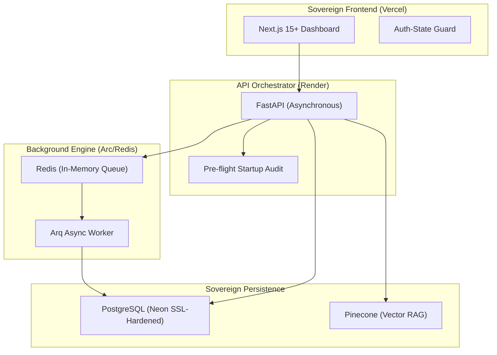

<div align="center">
  <br />
  
  <br />
  <h1 align="center"><b>🌌 GraftAI: The Sovereign AI Scheduler</b></h1>
  <p align="center">
    <b>A Enterprise-Ready, AI-First Orchestration Layer for Modern Workflows.</b><br />
    <i>Sovereign identity, proactive intelligence, and high-performance scheduling.</i>
  </p>
  
  <p align="center">
    
    
    
    
  </p>

  <br />
  <h2 align="center">✨ Real Feature Showcase</h2>
  <div align="center">
    
    
    <br />
    
  </div>
  <br />
  <br />
</div>

---

## 💎 The Vision
**GraftAI** isn't just a calendar; it's an **Autonomous Orchestration Layer**. It "grafts" high-fidelity AI directly into your enterprise stack, bridging the gap between raw LLM intelligence and secure, high-stakes business operations.

---

## 🛠️ The Tech Stack

| Layer | Technology | Key Capabilities |
| :--- | :--- | :--- |
| **Frontend** |  | App Router, Server Actions, Framer Motion |
| **Backend** |  | Asynchronous Pydantic v2, Dependency Injection |
| **Intelligence** |  | RAG Workflows, Proactive Agentic Behavior |
| **Identity** |  | Google, GitHub, Microsoft, Apple, Passkeys |
| **Storage** |  | SQLAlchemy 2.0 (Async), High-Performance Migrations |
| **Vector Engine**|  | Contextual Memory with High-Dimensional Indexing |

---

## 🚀 Core Features

### 🔐 1. Identity & Sovereignty (Sovereign Tier)
* **HttpOnly Cookie Isolation**: Hardened session management using `HttpOnly`, `Secure`, `SameSite=Strict` cookies to eliminate XSS/CSRF vectors.
* **Biometric FIDO2/WebAuthn**: Passwordless login with native TouchID/FaceID support.
* **GDPR Soft-Delete**: Secure account offboarding with a 30-day retention grace period and automated background purging.

### 🤖 2. Proactive AI Intelligence
* **Contextual Memory (RAG)**: High-fidelity meeting context extraction powered by LangChain and Pinecone.
* **Resilient Sync Engine**: Non-blocking, atomic synchronization with Google, Microsoft Graph, and Zoom.
* **Natural Language Orchestration**: Chat-driven scheduling that understands intent and nuances.

### 📊 3. Enterprise Hardening (Zero-Crash)
* **Production Pre-flight Audit**: Automatic startup verification of Database, Redis, and Environment availability.
- **SSL Resilience**: Hardened database connection pooling (Tuned for Render/Neon instability).
* **Worker-Centric Reminders**: Atomic 'Scan-Mark-Send' pattern to prevent duplicate event notifications.

---

## 🏗️ Technical Architecture



---

## 🛠️ Rapid Setup

### 1. Environment Configuration
Create a `.env` in the `backend/` directory with your premium credentials:
```bash
# Core
DATABASE_URL=postgresql+asyncpg://...
PINECONE_API_KEY=pcsk_...

# AI
GROQ_API_KEY=gsk_...
OPENAI_API_KEY=sk_...

# Identity (Production URLs)
FRONTEND_BASE_URL=https://graft-ai-two.vercel.app
APP_BASE_URL=https://graftai.onrender.com

# Billing / Razorpay
RAZORPAY_KEY_ID=rzp_test_...
RAZORPAY_KEY_SECRET=...
RAZORPAY_WEBHOOK_SECRET=...
RAZORPAY_PLAN_PRO_ID=plan_...
RAZORPAY_PLAN_ELITE_ID=plan_...
```

### 2. Razorpay Billing Flow
1. User selects a paid plan on the pricing page.
2. The frontend requests a Razorpay subscription from `/api/v1/billing/razorpay/create-subscription`.
3. The backend creates or reuses a Razorpay customer, then creates a subscription and stores the subscription ID.
4. The frontend opens Razorpay Checkout with the returned subscription ID.
5. Razorpay delivers recurring payment status via webhook to `/api/v1/billing/razorpay/webhook`.
6. The backend updates the user’s `subscription_status` and `tier` in the database.
7. Users can cancel directly from the dashboard, which calls `/api/v1/billing/razorpay/cancel-subscription`.

---

### 2. Backend Orchestrator
```bash
cd backend
python -m venv .venv
# Activate venv
pip install -r requirements.txt
python app.py  # High-performance Uvicorn worker manager
```

### 3. Frontend Experience
```bash
cd frontend
npm install
npm run dev
```

---

## 🛡️ Security Posture
GraftAI implements the **Zero-Trust Security Model**:
*   **HttpOnly Isolation**: JWTs are never exposed to JavaScript, preventing XSS-based account takeovers.
-   **CSRF Hardening**: Enforced `SameSite=Strict` and CORS origin-filtering.
*   **Encrypted Payloads**: All data is encrypted at rest (AES-256) and in transit (TLS 1.3).
*   **Sandboxed AI**: AI agents operate in a restricted environment with limited resource access.
*   **Audit Logging**: Every authentication and database transaction is logged as exception-safe events.

---

<div align="center">
  <p><b>Built for the future of work by GraftAI Labs.</b></p>
  
</div>
