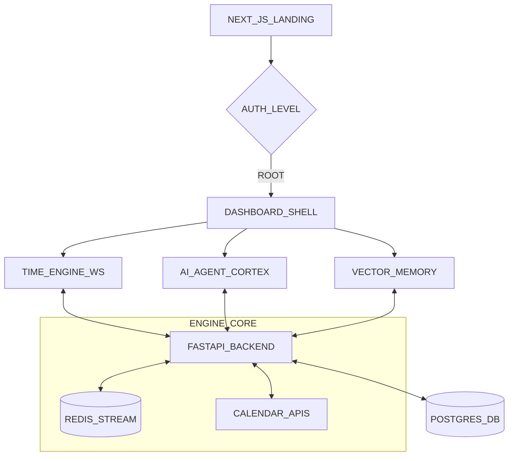

# 🖥️ GRAFT_AI [STABLE_RELEASE v3.0]

> **CORE_KERNEL** | **DEEP_BLACK** | **PRO_TELEMETRY** | **V_VECTOR_SYNC**

GraftAI is a precision-engineered, programmable scheduling engine designed for technical teams. It leverages a high-contrast [Deep Black] aesthetic with real-time system telemetry and AI-driven semantic memory.

---

## 🏗️ SYSTEM_ARCHITECTURE



---

## ⚡ CORE_PROTOCOLS

- 🔳 **DEEP_BLACK_UI** - Strictly high-contrast #050505 baseline with Neon Green telemetry overlays.
- 🧬 **SEMANTIC_MEMORY** - Vector-store backed RAG pipeline for intelligent availability management.
- ⏱️ **TIME_ENGINE** - Live SVG-driven motion pipeline visualizing real-time backend events via WebSockets.
- 🔐 **ROOT_ACCESS** - OAuth2 + JWT secured authentication with granular API scope management.
- 🔌 **DEV_CORNER** - Dedicated in-app technical hub for system logs, metrics, and security audits.

---

## 🛠️ STACK_RESOURCES

### KERNEL (BACKEND)
- **Engine**: FastAPI 0.100+ (Python 3.11)
- **Database**: PostgreSQL [AsyncPG]
- **Stream**: Redis 7.0 for real-time task queuing
- **Intelligence**: OpenAI GPT-4 + LlamaIndex RAG
- **Monitoring**: Prometheus + Custom LogAnalyzer

### INTERFACE (FRONTEND)
- **Framework**: Next.js 15+ (React 19)
- **Styling**: Tailwind CSS 4 + Global CSS Technical Tokens
- **Motion**: Framer Motion 11 [TimeEngineAnimation]
- **Icons**: Lucide Precision Icons
- **Auth**: NextAuth v5 [Beta]

---

## 🚀 KERNEL_INITIALIZATION

### 1. ENVIRONMENT_SYNC
```bash
git clone https://github.com/yourusername/graftai.git
cd graftai
```

### 2. BACKEND_EXEC
```bash
cd backend
pip install -r requirements.txt
uvicorn api.main:app --host 0.0.0.0 --port 8000 --reload
```

### 3. FRONTEND_BOOT
```bash
cd frontend
npm install
npm run dev
```

---

## 📡 TELEMETRY_API_REFERENCE

### AUTH_PROTOCOLS
```text
POST   /api/v1/auth/login             - Standard Entry
GET    /api/v1/auth/google/login      - Google_Sync
GET    /api/v1/auth/check             - Session_Verify
```

### ENGINE_MONITOR
```text
GET    /monitoring/health             - Kernel_Status
WS     /monitoring/ws                 - Realtime_Stream
GET    /monitoring/admin/logs         - Root_Audit
```

### AI_CORTEX
```text
POST   /api/v1/ai/schedule            - Request_Sync
GET    /api/v1/ai/suggestions         - Load_Suggestions
```

---

## 📚 GITHUB DOCUMENTATION LINKS
- SES Documentation: https://github.com/johan-droid/GraftAI/blob/main/docs/SES_DOCUMENTATION.md
- Technical Architecture: https://github.com/johan-droid/GraftAI/blob/main/docs/TECHNICAL_DOCUMENT.md
- Feature Overview: https://github.com/johan-droid/GraftAI/blob/main/docs/FEATURE_DOCUMENT.md

---

## 🎨 DESIGN_SYSTEM

| TOKEN | HEX_CODE | PURPOSE |
| :--- | :--- | :--- |
| --bg-base | `#050505` | Pitch Black Baseline |
| --primary | `#00FF9C` | Neon Green (Active) |
| --secondary | `#00E0FF` | Electric Cyan (Process) |
| --accent | `#FF007A` | Matrix Magenta (Alert) |
| --text-primary | `#FAFAFA` | High-Vibes White |

---

## 🔒 SECURITY_AUDIT

- 🛡️ **Zero-Trust**: All API endpoints require verified JWT or Scoped API Keys.
- 🕵️ **Log_Trace**: Real-time auditing of all automated scheduling decisions.
- 🗝️ **HMAC_SIG**: Webhook verification for all external calendar callbacks.

---

**[SYSTEM_STATUS: STABLE]**
*Built by Developers, for Developers.*
*Making time programmable, one cycle at a time.*
