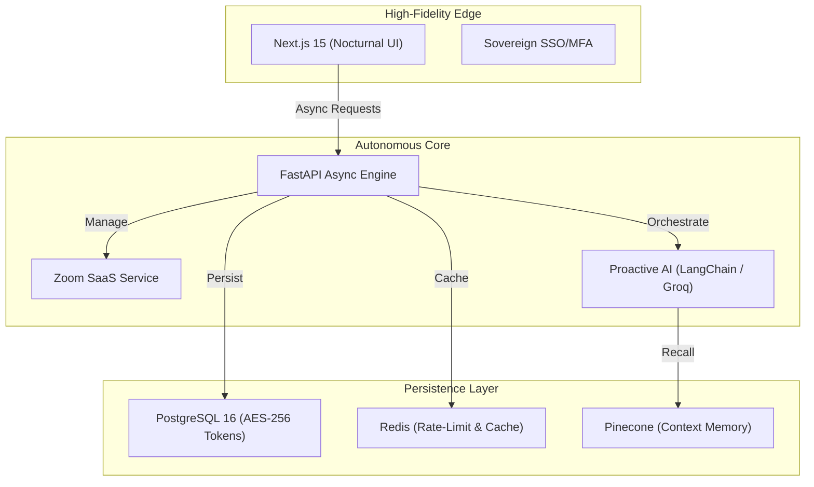

<div align="center">
  <br />
  
  <br />
  <h1 align="center"><b>🌌 GraftAI: The Sovereign Orchestration Layer</b></h1>
  <p align="center">
    <b>A High-Fidelity, AI-First Autonomous Engine for Modern Enterprise Workflows.</b><br />
    <i>Sovereign identity, proactive intelligence, and high-performance cross-continental scheduling.</i>
  </p>
  
  <p align="center">
    
    
    
    
  </p>

  <br />
</div>

---

## 💎 The Vision
**GraftAI** is a premium, autonomous calendar layer that "grafts" high-fidelity AI directly into your executive stack. Designed for high-performance teams, it replaces chaotic coordination with silent, proactive orchestration.

### ✨ SaaS-Grade Features
- **Proactive AI Agent**: An autonomous LLM engine (Groq/Llama-3.3) that anticipates your scheduling needs.
- **Strong Calendar Connections**: Persistent, enterprise-grade OAuth for Google and Microsoft ecosystems.
- **Sovereign AI Memory**: Local-first vector RAG (Pinecone + HuggingFace) for private, zero-latency context recall.
- **Deep Zoom Integration**: SaaS-grade, user-level token persistence with AES-256 encryption.
- **The Obsidian Interface**: A high-fidelity, glassmorphic nocturnal UI (Next.js 15) optimized for deep focus.
- **Autonomous Notifications**: Real-time SMTP and OneSignal push integration for meeting lifecycle events.

---

## 🏗️ Premium Architecture



---

## 🚀 Rapid Deployment

### 1. Requirements
- Node.js 20+
- Python 3.11+
- Docker & Docker Compose
- Environment keys (Groq, OpenAI, Pinecone, Zoom)

### 2. Local Setup
```bash
# Clone and enter
git clone https://github.com/johan-droid/GraftAI.git
cd GraftAI

# Configure Core
cp backend/.env.example backend/.env

# High-Performance Backend
cd backend && pip install -r requirements.txt
python app.py

# Modern Frontend
cd ../frontend && npm install
npm run dev
```

### 3. Docker Orchestration
```bash
docker-compose up --build
```

---

## ⚙️ Technical Core (Architectural Evolution)
GraftAI has transitioned to a **Standalone Better Auth** implementation for maximum sovereignty and direct database integration.

### Authentication Strategy
- **Sovereign Control**: Full session lifecycle management without third-party proxies.
- **Biometric Integration**: Native support for FIDO2/Passkey via WebAuthn.
- **Multi-Tenant Identity**: Secure mapping of OAuth accounts (Google, GitHub, Microsoft, Apple) to internal user records.

### Database Architecture
- **Neon Postgres**: Direct connectivity via `pg.Pool` for sub-millisecond latency.
- **SQLAlchemy 2.0**: Asynchronous backend persistence with high-performance connection pooling.
- **Vector Memory**: Pinecone-backed RAG for long-term AI context and recall.

---

## 🛡️ Security Posture
GraftAI implements a **Zero-Trust Security Framework**:
*   **Encrypted Secrets**: All OAuth and Zoom tokens are encrypted at rest using AES-256 bit Fernet logic.
*   **HttpOnly Isolation**: JWTs are strictly isolated from client-side script access.
*   **Granular Privacy**: AI agents operate within isolated multi-tenant contexts to ensure absolute data sovereignty.

---

<div align="center">
  <p><b>Built for the future of work by the Graft Research Labs.</b></p>
  
</div>
-success?style=flat-square" />
</div>
