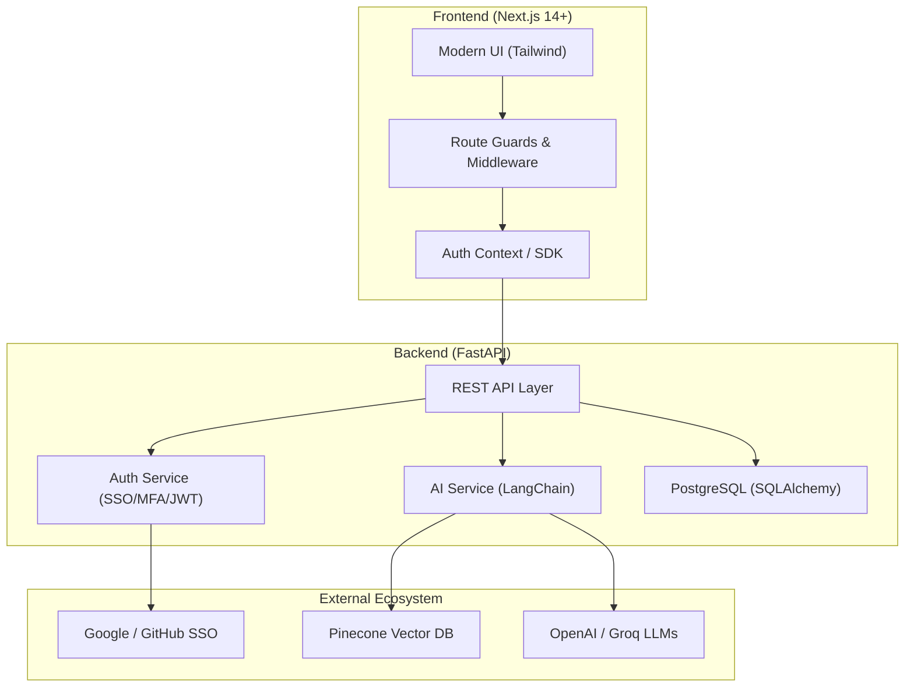

<div align="center">
  <br />
  <p align="center">
    <h1 align="center">🌌 GraftAI</h1>
  </p>
  <p align="center">
    <strong>Next-Generation AI Scheduling & Enterprise Auth Platform</strong>
  </p>
  <p align="center">
    
    
    
    
    
  </p>
</div>

---

## 🚀 Mission
**GraftAI** is a high-performance, secure-by-default scheduling platform that "grafts" sophisticated AI intelligence onto enterprise workflows. Built with a focus on mobile-first design, identity sovereignty, and proactive automation.

---

## 🏗️ Architecture



---

## ✨ Features

### 🔐 Bank-Grade Authentication
- **Multi-Factor Authentication (MFA)**: TOTP-based secondary verification.
- **SSO & Passwordless**: Seamless login via Google/GitHub or secure magic links.
- **WebAuthn / FIDO2**: Biometric and hardware-key support for maximum security.
- **Identity Sovereignty**: Decentralized Identifier (DID) integration ready.

### 🤖 Proactive AI Orchestration
- **Context-Aware Scheduling**: Integrated with Pinecone for long-term memory.
- **LangChain Powered**: Advanced RAG workflows for personalized scheduling assist.
- **Proactive Insights**: Automated analytics and suggestion engine.

### 💎 Premium Experience
- **Galaxy SaaS Aesthetic**: Immersive dark mode with vibrant glassmorphism.
- **Mobile-First Design**: Fully responsive, high-performance interface.
- **Real-time Sync**: Low-latency updates and session management.

---

## 🛡️ Security Grade

GraftAI implements a layered security model:
- **JWT Validation**: RS256/HS256 validation with Auth0 support.
- **Context Isolation**: Strict multi-tenant data separation in Vector DB.
- **Proactive Consent**: Granular permission management for AI interactions.
- **CORS & Rate Limiting**: Production-hardened API protection.

---

## 🛠️ Getting Started

### Backend Setup
```bash
cd backend
python -m venv .venv
# Activate venv: .venv\Scripts\activate (Windows) or source .venv/bin/activate (Unix)
pip install -r requirements.txt
uvicorn backend.api.main:app --reload
```

### Frontend Setup
```bash
cd frontend
npm install
npm run dev
```

### Environment Configuration
Ensure you have a `.env` in the root with:
- `DATABASE_URL`, `PINECONE_API_KEY`, `OPENAI_API_KEY`
- `SECRET_KEY`, `JWT_SECRET`
- `GOOGLE_CLIENT_ID`, `GOOGLE_CLIENT_SECRET` (for SSO)

---

## 🚀 Deployment

- **Frontend**: Optimized for Vercel.
- **Backend**: Tailored for Render, DigitalOcean, or Docker Compose.
- **CI/CD**: GitHub Actions ready for linting and type checking.

---

## 📄 License
TBD (MIT/Apache 2.0)

<div align="center">
  <p>Built with ❤️ by the GraftAI Team</p>
</div>
