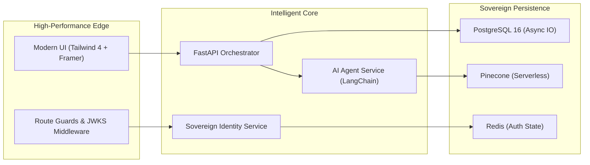

<div align="center">
  <br />
  
  <br />
  <h1 align="center"><b>🌌 GraftAI: The Sovereign AI Scheduler</b></h1>
  <p align="center">
    <b>A Enterprise-Ready, AI-First Orchestration Layer for Modern Workflows.</b><br />
    <i>Sovereign identity, proactive intelligence, and high-performance scheduling.</i>
  </p>
  
  <p align="center">
    
    
    
    
  </p>

  <br />
  
  <br />
  <br />
</div>

---

## 💎 The Vision
**GraftAI** isn't just a calendar; it's an **Autonomous Orchestration Layer**. It "grafts" high-fidelity AI directly into your enterprise stack, bridging the gap between raw LLM intelligence and secure, high-stakes business operations.

---

## 🛠️ The Tech Stack

| Layer | Technology | Key Capabilities |
| :--- | :--- | :--- |
| **Frontend** |  | App Router, Server Actions, Framer Motion |
| **Backend** |  | Asynchronous Pydantic v2, Dependency Injection |
| **Intelligence** |  | RAG Workflows, Proactive Agentic Behavior |
| **Identity** |  | Google, GitHub, Microsoft, Apple, Passkeys |
| **Storage** |  | SQLAlchemy 2.0 (Async), High-Performance Migrations |
| **Vector Engine**|  | Contextual Memory with High-Dimensional Indexing |

---

## 🚀 Core Features

### 🔐 1. Identity & Sovereignty
* **Universal SSO**: Native integration with Google, GitHub, Microsoft, and Apple.
* **Biometric Auth**: Passwordless login using FIDO2/WebAuthn (TouchID/FaceID).
* **Identity Guard**: Multi-factor authentication (TOTP) and proactive session isolation.
* **Cookie-less Magic**: Secure magic link delivery for instant, zero-password access.

### 🤖 2. Proactive AI Intelligence
* **Contextual Memory**: Powered by RAG (Retrieval Augmented Generation) for long-term user context.
* **Proactive Scheduling**: AI doesn't just react; it analyzes patterns and suggests optimized slots.
* **Natural Language UI**: Chat-driven scheduling that understands nuances like "find a quick sync before my flight."
* **Advanced RAG**: Integrated via Pinecone with strict tenant isolation for enterprise data.

### 📊 3. Enterprise Observability
* **Live Analytics**: Real-time tracking of meeting health and team productivity.
* **Proactive Reminders**: Smart notifications that trigger based on context, not just time.
* **Multi-Cloud Ready**: Designed for horizontal scaling across Kubernetes/Docker or Serverless.

---

## 🏗️ Technical Architecture



---

## 🛠️ Rapid Setup

### 1. Environment Configuration
Create a `.env` in the `backend/` directory with your premium credentials:
```bash
# Core
DATABASE_URL=postgresql+asyncpg://...
PINECONE_API_KEY=pcsk_...

# AI
GROQ_API_KEY=gsk_...
OPENAI_API_KEY=sk_...

# Identity (Production URLs)
FRONTEND_BASE_URL=https://graft-ai-two.vercel.app
APP_BASE_URL=https://graftai.onrender.com
```

### 2. Backend Orchestrator
```bash
cd backend
python -m venv .venv
# Activate venv
pip install -r requirements.txt
python app.py  # Wrapper with built-in anti-sleep pinger
```

### 3. Frontend Experience
```bash
cd frontend
npm install
npm run dev
```

---

## 🛡️ Security Posture
GraftAI implements the **Zero-Trust Security Model**:
*   **Encrypted Payloads**: All data is encrypted at rest (AES-256) and in transit (TLS 1.3).
*   **Sandboxed AI**: AI agents operate in a restricted environment with limited resource access.
*   **Strict CORS**: Production-grade origin filtering and header protection.
*   **Audit Logging**: Every authentication event is logged for enterprise compliance.

---

<div align="center">
  <p><b>Built for the future of work by GraftAI Labs.</b></p>
  
</div>
