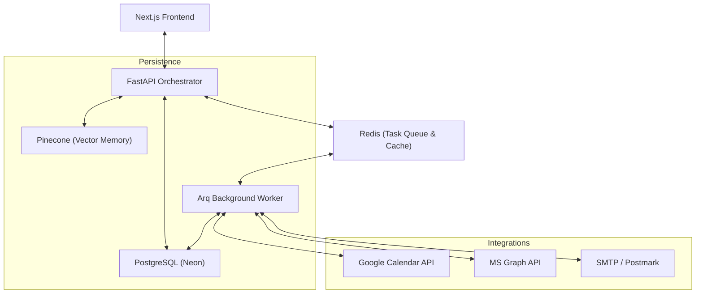

# Software Requirements Specification (SRS): GraftAI Sovereign

**Version**: 1.2.0  
**Status**: Production-Hardened  
**Date**: April 2026  

---

## 1. Introduction

### 1.1 Purpose
GraftAI is a high-performance, enterprise-grade AI scheduling orchestrator. It is designed to "graft" proactive intelligence into existing workflows via deep integrations with Google Calendar, Microsoft Outlook, and Zoom, while maintaining absolute data sovereignty through a zero-trust security model.

### 1.2 Scope
The system includes:
- **Asynchronous API Orchestrator** (FastAPI)
- **Background Job Engine** (Arq + Redis)
- **Intelligence Layer** (LangChain + Pinecone RAG)
- **Identity Service** (Better Auth + Custom FIDO2/MFA)
- **Persistence Layer** (PostgreSQL + Neon)

---

## 2. System Architecture

### 2.1 Component Diagram

### 2.2 Data Residency & Sovereignty
- **Primary Data**: Stored in PostgreSQL with SSL-enforced connections.
- **Vector Data**: Stored in isolated Pinecone namespaces per tenant/user.
- **Session Data**: Ephemeral state managed in Redis with TTL-based revocation.

---

## 3. Functional Requirements

### 3.1 Identity & Access Management (IAM)
- **FR-AUTH-01**: Multi-provider SSO (Google, GitHub, Microsoft).
- **FR-AUTH-02**: FIDO2/WebAuthn Biometric passwordless authentication.
- **FR-AUTH-03**: GDPR-compliant **30-day Soft-Delete** lifecycle.
- **FR-AUTH-04**: Role-Based Access Control (RBAC) for Admin/Member/Service accounts.

### 3.2 Proactive Scheduling Engine
- **FR-SCH-01**: Bidirectional synchronization with Google and Outlook.
- **FR-SCH-02**: Atomic conflict detection and resolution.
- **FR-SCH-03**: Real-time event reminders via background worker (Arq).
- **FR-SCH-04**: Webhook-based "Perfect Sync" across external providers.

### 3.3 Intelligence (RAG) System
- **FR-AI-01**: Automatic event context vectorization into Pinecone.
- **FR-AI-02**: Natural language intent parsing for schedule adjustments.
- **FR-AI-03**: Fallback mechanisms for Vector Store outages to maintain core API functionality.

---

## 4. Non-Functional Requirements

### 4.1 Security & Compliance
- **NFR-SEC-01**: **Zero-Trust Auth**: HttpOnly/Secure/SameSite session cookies.
- **NFR-SEC-02**: **Production Hardening**: Mandatory pre-flight startup audits for all infra dependencies.
- **NFR-SEC-03**: Global Exception Handling to prevent internal stack trace leakage.

### 4.2 Performance & Scalability
- **NFR-PERF-01**: Fully asynchronous non-blocking I/O using `uvloop`.
- **NFR-PERF-02**: Connection pooling with SQLAlchemy 2.0 and manual pool-recycle tuning for high-latency hosts (Render/Neon).

### 4.3 Reliability
- **NFR-REL-01**: Atomic worker pattern for event notifications (preventing duplicate emails).
- **NFR-REL-02**: 99.9% availability goal via distributed Arq workers.

---

## 5. Deployment & DevOps

- **Backend**: Render (Python 3.11+, Uvicorn)
- **Frontend**: Vercel (Next.js 15+)
- **Database**: Neon (Postgres 16, SSL Required)
- **Monitoring**: Structured logging with severity-level auditing.

---
*Built and maintained by GraftAI Engineering.*
